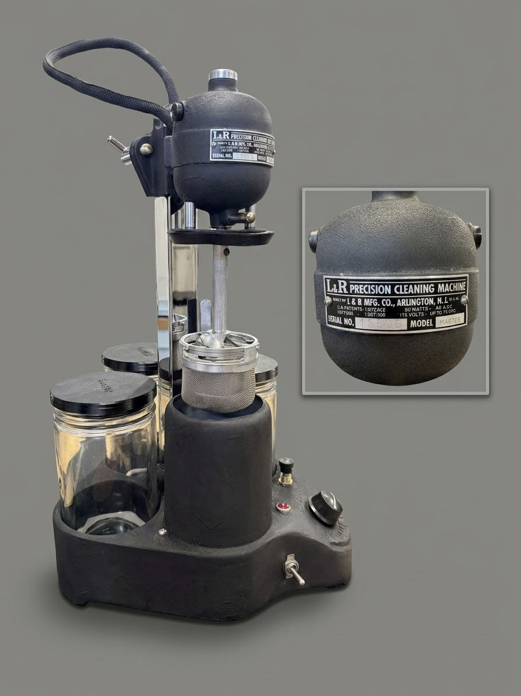

# L&R Master Watch Cleaning Machine — Restoration (S/N 13505)

Open-source restoration and reverse-engineering of a vintage **L&R Mfg. Co. Master Watch Cleaning Machine** (Master, Serial 13505; the early oiled-bearing generation). This repository documents the full mechanical, cosmetic, and electrical restoration of the machine — from a seized, previously-modified relic to a **working, safely-grounded, fully-documented** cleaner — and contains a complete set of reverse-engineered engineering drawings and a three-part workshop manual, all produced from direct physical measurement of the specimen.

> **REPRODUCTION DOCUMENTATION** — Not original L&R Mfg. Co. technical publications. All drawings, dimensional data, and procedures were reverse-engineered from direct physical work on specimen S/N 13505. Curated by Hobbs R.E., 2026. For restoration reference only.

## Project Status

**🏁 The machine is fully restored and functional.** Both the motor/power head and the control unit are complete and bench-verified running on mains — the motor runs and reverses, the rheostat controls speed, the heater and pilot work, and the wiring passed a full cold-check before first power-on.

| Area | Status |
|---|---|
| **Mechanical restoration** | ✅ Complete — housing refinishing, ultrasonic cleaning, gasket conditioning, sleeve-bearing & wick overhaul, full reassembly |
| **Cosmetic refinishing** | ✅ Complete — motor housings + control-unit casting in VHT wrinkle finish; chrome re-plated; cast lettering restored |
| **Electrical** | ✅ Complete — meter-verified as-found circuit, then a **modern 3-wire grounded rewire** (silicone wire, Wago lever-nut junctions, chassis ground bond); Stage-0 cold-checks passed; commissioned |
| **Dimensional dataset** | ✅ Complete — motor/power head + control unit (base casting, carrier); all confidence-labeled |
| **Engineering drawings** | ✅ Complete — **16-sheet package** (component, exploded, and electrical) on a common master template |
| **Workshop manual** | ✅ First draft — all three parts (Operating / Maintenance / Restoration) |
| **Publication polish** | ⬜ In progress — manual compile, final photos, LICENSE + git init |

## The Machine

A vintage universal-series-motor watch cleaning machine: a mesh basket of disassembled watch parts is spun (forward and reverse) through solvent and rinse jars, then dried in a heated chamber. The motor head rides a swiveling carrier to index the basket over each station.

This restoration preserves the original mechanical character and appearance while **modernizing the electrical system for safety and serviceability** — the original was an ungrounded 2-wire design with a live "green" wire and no earth ground, and the specimen showed prior amateur rework. The rebuild adds a 3-wire grounded cord, a chassis ground bond, high-temp silicone wire, and serviceable lever-nut junctions; every deviation from original is documented.

Designed by **Frank Regero** and built by **L&R Mfg. Co.**; the machine embodies U.S. Patents **1,817,266** (1931), **1,872,812** (1932), and **1,907,366** (1933) — all verified, with copies and details in [`reference/patents/`](reference/patents/) (see [`reference/nameplate-and-patents.md`](reference/nameplate-and-patents.md)).

## Repository Layout

| Path | Contents |
|---|---|
| `docs/manual/` | **Workshop manual** — Part I (Operating), Part II (Maintenance & Service), Part III (Restoration), plus the as-performed source logs (`restoration-log.md`, `teardown-log.md`) |
| `docs/dimensions/` | Confirmed dimensional datasets (CSV) — parts dictionaries (BOM) + per-assembly measurements |
| `drawings/components/` | 2D engineering blueprints — motor components (UH / LH / BRG×2 / ARM / STR / HW / SPN / PLT / BSK), the motor-mount carrier (NCK-002), and the base casting (LR-BASE-001) |
| `drawings/exploded/` | Exploded assembly drawings — EXP-001 (2D profile) + EXP-002 (3D axonometric) |
| `drawings/electrical/` | Schematics — LR-ELEC-002 (verified as-found) + LR-ELEC-003 (as-built 3-wire grounded rewire) |
| `drawings/source/` | Plain-text (`.svg.txt`) snapshots of each drawing (1:1 with the live SVGs) |
| `photos/` | Bench documentation photos by subsystem (housing, armature, bearings, stator-wiring, gasket, basket, hardware, base-refinish, control-unit) |
| `reference/` | External reference material (vintage manuals, archive PDFs, styling references) |
| `archive/` | Superseded drafts and working material — **not part of the published project** (git-ignored) |
| `CLAUDE.md` | Master project log / engineering state (single source of truth) |

## Conventions

- Every physical component carries a canonical **Part ID** (e.g. `UH-003`, `ARM-006`, `STR-002`, `BAS-006`, `NCK-002`) defined in the parts dictionaries under `docs/dimensions/`. All drawings and docs reference parts by ID.
- Dimensions are labeled **(CONFIRMED)** / **(EST.)** / **(SYN)** / **(REF)** for measurement provenance.
- Because no original L&R manual for this machine was obtained, operating/maintenance procedures are labeled **best-judgment** (reconstructed from the mechanism), not factory-verified.
- Engineering-drawing pipeline: dimensions captured to CSV → drawings rendered on a 1200×800 master template → each kept as a `.svg.txt` source snapshot.

## License

Licensed under the **Creative Commons Attribution 4.0 International License (CC BY 4.0)** — see the [`LICENSE`](LICENSE) file. In short: you may use, adapt, and redistribute the material (including commercially), provided you give appropriate credit.

Suggested attribution: *"L&R Master Watch Cleaning Machine Restoration (S/N 13505) by Hobbs R.E., licensed under CC BY 4.0."*
